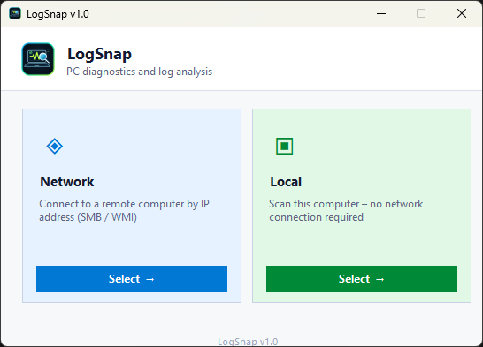
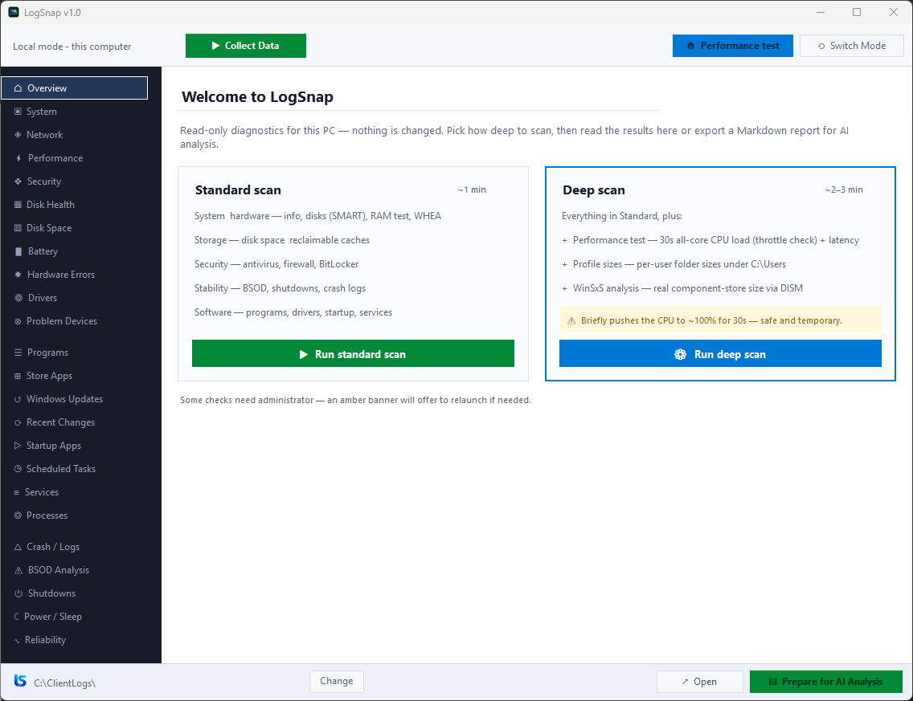
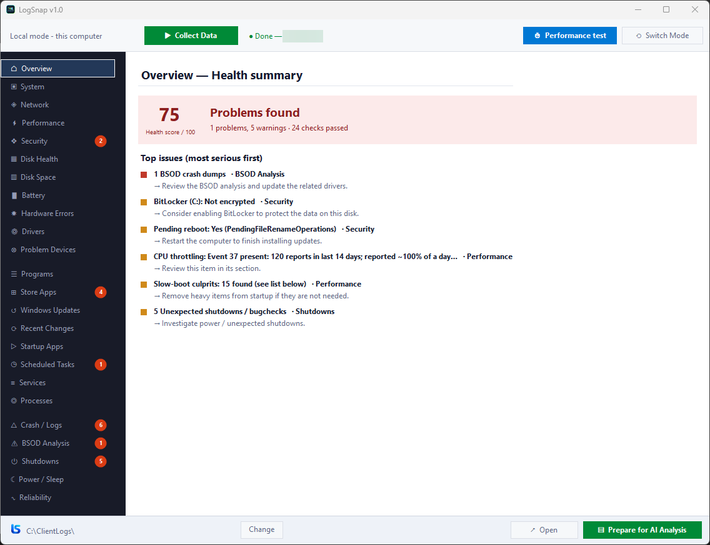
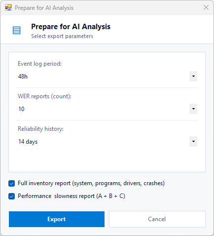
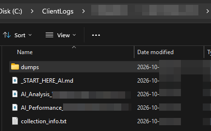
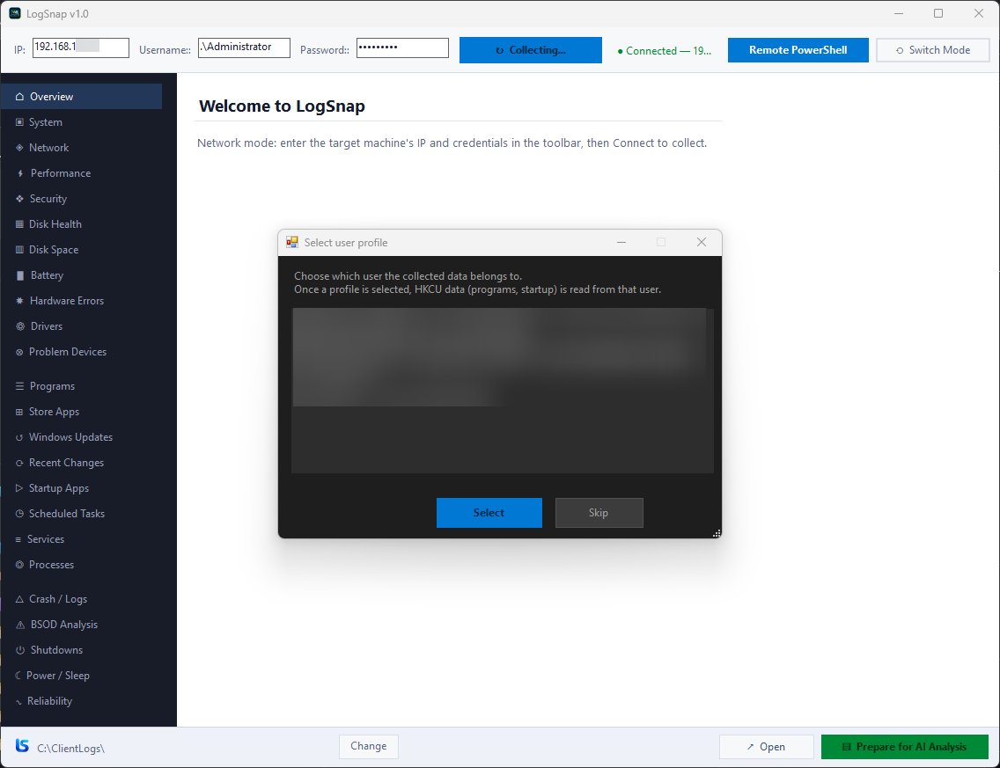
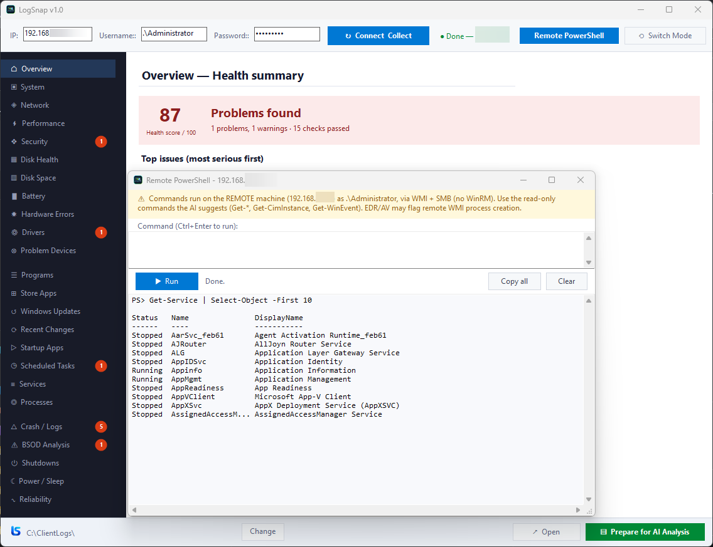

  

  # LogSnap

  **Read-only Windows diagnostics. Collect the logs that matter, export clean Markdown for AI analysis.**

  
  
  
  

  [**⬇ Download the latest release**](../../releases/latest)

---

## What it is

LogSnap is a portable, **read-only** diagnostics tool for Windows technicians.
It gathers the facts that actually explain a problem - crashes, disk health,
hardware errors, power/sleep issues, slow-performance evidence, recent changes,
security state and more - and exports everything to a clean set of **Markdown**
files you can hand straight to an AI (or a colleague) for analysis.

It reads. It never changes your system.

## Screenshots

  
<b>1. Pick local or a remote computer</b>

  
    
  
<b>2. Choose how deep to scan</b>

  
    
  
<b>3. Get a ranked health summary</b>

  
    
  
<b>4. Export a clean Markdown report for AI</b>

  
    
  
<b>5. Ready-to-share output files</b>

  

### Network mode - diagnose a remote PC

  
<b>Connect by IP, then pick the user profile to read</b>

  
    
  
<b>Run read-only PowerShell on the remote machine (WMI + SMB, no WinRM)</b>

  

## Why it is different

- **Read-only** - collects data, never modifies the machine.
- **Facts, not guesses** - the Markdown export stays factual; verdicts and
  recommendations live only in the UI, so the AI isn't biased by the tool.
- **Real hardware truth** - actual SMART wear % and temperature (NVMe + SATA),
  Windows Memory Diagnostic results, WHEA hardware errors, GPU health (TDR).
- **"What changed?"** - recent updates, drivers and installs lined up against
  the moment things broke.
- **Portable** - one `.exe`, no installer, no dependencies to deploy.
- **Local or over the network** - diagnose this PC or a remote one (admin + SMB/WMI).

## What it collects

Crashes & BSOD · minidump list · Reliability history · Shutdown/boot events ·
Disk health (SMART) · Disk space forensics · Hardware errors (WHEA) ·
Memory diagnostic · GPU health · Problem devices · Power & sleep · Battery ·
Performance evidence · User profile diagnostics · Security state (AV/firewall) ·
Network · Services · Startup · Scheduled tasks · Installed programs & updates.

## Quick start

1. [Download `LogSnap.exe`](../../releases/latest).
2. Run it (right-click -> **Run as administrator** for full hardware detail).
3. Choose **Standard** or **Deep** scan.
4. When it finishes, open the output folder - start with **`_START_HERE_AI.md`**.
5. Paste the Markdown into your AI assistant and ask what's wrong.

## Requirements

- Windows 10 or 11 (also works on recent Windows Server).
- .NET Framework 4.8 (built into modern Windows).
- Administrator rights recommended (some hardware reads need them).

## A note on trust

LogSnap is unsigned for now, so SmartScreen or antivirus may warn on first run -
this is common for new, independently built tools. It is read-only and does not
phone home. Each release lists the file's **SHA-256** so you can verify the exact
binary you downloaded.

## Documentation

Full documentation (what each section means and how the data is collected) is
attached to each [release](../../releases/latest).

## License

Freeware - free to use, no redistribution or resale. See [LICENSE.txt](LICENSE.txt).

---

  Built by <b>LS</b> · Windows · .NET · IT diagnostics

